# 准备

1. 软件

    Assetto Corse
    
    Assetto Corse SDK
    
    3D 建模软件（Blender）

    图片编辑软件（Procreate/PS）

2. 素材

    一张赛道的俯视图（带测量数据）

3. 参考

        https://assettocorsamods.net/threads/build-your-first-track-basic-guide.12/

# 0. 流程梳理

1. 编辑配置信息
    * 地图基本信息
    * 表面（surface）配置信息
1. 制作模型
    * 参考物的选取
    * 建模
    * 贴图和纹理
2. 导出模型
    * 坐标轴的校准
    * 单位的校准
3. 导入AC SDK并编辑材质
    * 导入并预览FBX文件
    * 编辑材质
4. 导出地图文件
    * 保存配置
    * 导出地图
5. 试玩

# 1.  编辑配置信息

**在这一部分我们会介绍赛道的基本文件结构以及新建一个赛道。**

首先我们需要找到一个现存的赛道作为例子

在steam中右键 `AC -> 管理 -> 浏览本地文件`

打开 `content -> tracks`

这个目录中的子目录就是AC的赛道信息了，随便打开一个

这里我们介绍一下赛道信息的目录结构

`ai/` 里面是给游戏的ai设定的最佳路线，不是必要的，有机会可以单独出教程，这里略过

`data/` 这个目录是赛道的配置信息，是存在 *.ini 文件里的。 其中必须有的是 `surface.ini`, 这个文件定义了游戏引擎分配物理特性的设置，不同的物理材质分别写在用空行分隔的代码段中：

        [SURFACE_0]
        KEY=TARMAC-DRIFT // 物理材质名, 这个名字会影响建模时不同组件的名字
        FRICTION=1
        DAMPING=0
        WAV=       
        WAV_PITCH=0
        FF_EFFECT=NULL
        DIRT_ADDITIVE=0
        IS_VALID_TRACK=1
        BLACK_FLAG_TIME=0
        SIN_HEIGHT=0
        SIN_LENGTH=0
        IS_PITLANE=0
        VIBRATION_GAIN=0
        VIBRATION_LENGTH=0

各个参数的影响可以自行调整尝试，这里一定不能搞错的是 `KEY`。

在本教程中，我们只使用官方预定义的几个材质，在游戏根目录 `system -> data -> surfaces.ini`
中有 `ROAD`, `GRASS`, `KERB`, `SAND` 四种材质的定义， 分别对应了 正常行驶的柏油路，赛道外的草地，路肩， 赛道外的沙地

`skin/` 可以跳过

`ui/` 里面包含了赛道的缩略图和背景图还有一个包含了赛道名字，标签，地理信息等的json文件

`*.kn5` 是地图的模型文件

`map.png` 比赛UI中显示的小地图，可以先忽略

`models.ini` 模型的配置文件，可以先忽略

回到赛道目录，复制其中一个赛道的目录，起一个新的名字，保留文件结构，其他的都删掉

打开 `ui` 目录， 编辑其中的 `ui_track.json` 文件：
我新建这个赛道是以之前去的一个卡丁车场为原型的，这里我就按照这个赛道的基本信息填写了

    {
        "name": "SD Karting Raceway",
        "description": "Beijing SD Karting Raceway",
        "tags" : [""test track","China", "Beijing", "Karting"],
        "geotags": ["lat", "lon"],
        "country": "China",
        "city": "Beijing",
        "length": "500",
        "width": "15",
        "pitboxes": "10",
        "run": "SDKARTING"
    }

从网上下载一个赛道的照片，裁剪到355*200的大小，作为预览图 `preview.png`

按照赛道的轮廓画一个赛道的地图缩略图， 保存为 `outline.png`

会到新地图的根目录，进入 `data` 目录，只保留 `surface.ini` 其他的都删掉

编辑 `surface.ini` 将 `system -> data -> surfaces.ini` 的内容复制到 `surface.ini` 中

到此为止，前期的准备和新建赛道的工作就完成了。

# 2. 制作模型

## 2.1 建模

在这一部分我们会根据参考图完成赛道的建模

本次教程中的赛道参考了 北京胜道博岳国际卡丁车场（化工路店）

首先第一步是获取赛道的参考图，以及一些基本的尺寸参数。

这里我用了Google Earth找到了该赛道的俯拍图，并且带着测距数据直接截屏作为参考了。

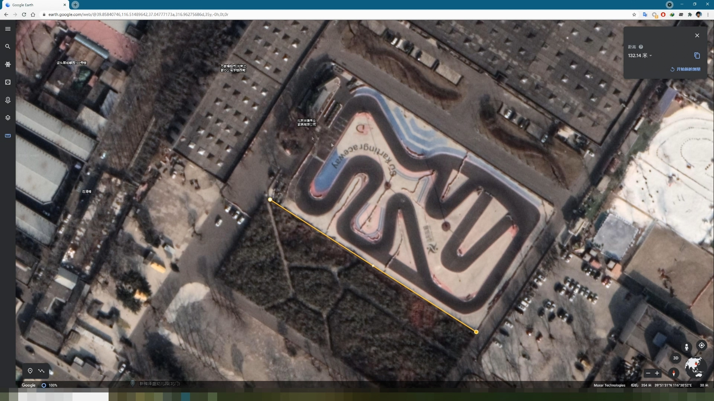

如果有条件也可以去获取赛道的详细参数，或者实地测量。本次教程的精度不高，这样的卫星地图就足够了。

对截图进行裁剪，使长边与地图上的测量线重合，方便我们在Blender中设置参考图的大小。

打开blender

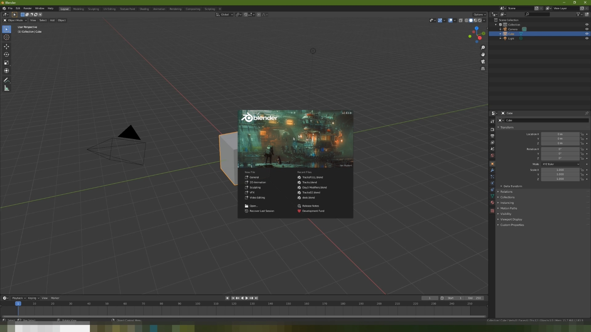

新建项目，清空项目

切换到顶视图

新建参考图

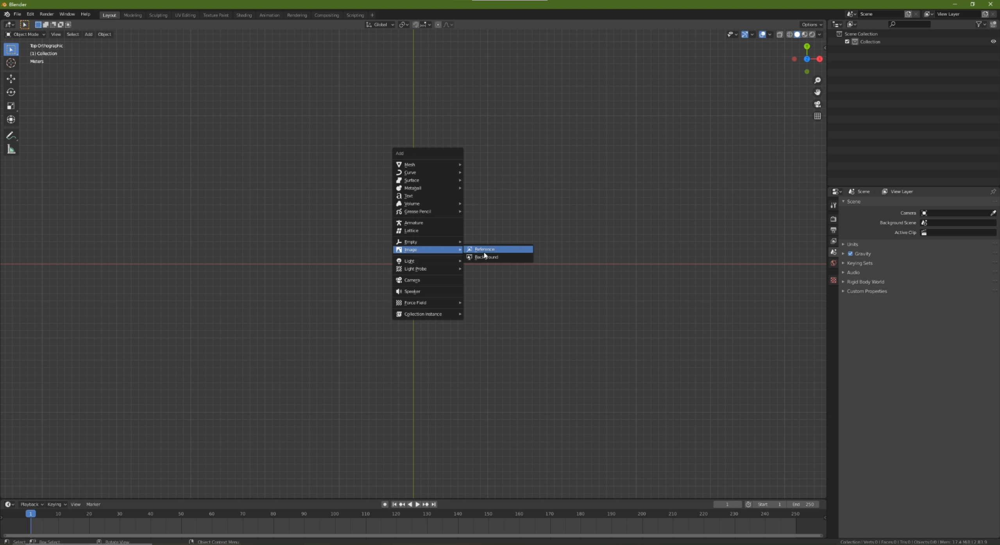

选择刚刚修剪好的图片

打开图片选项，将图片的大小调整到地图测量得到的值

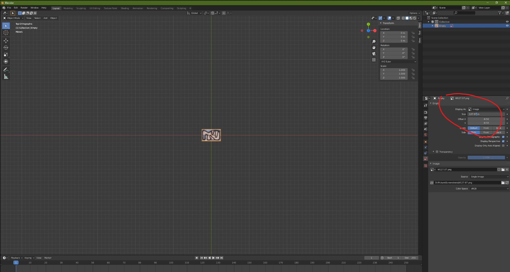

深度选择前置，透明度打开并且设置在0.3左右

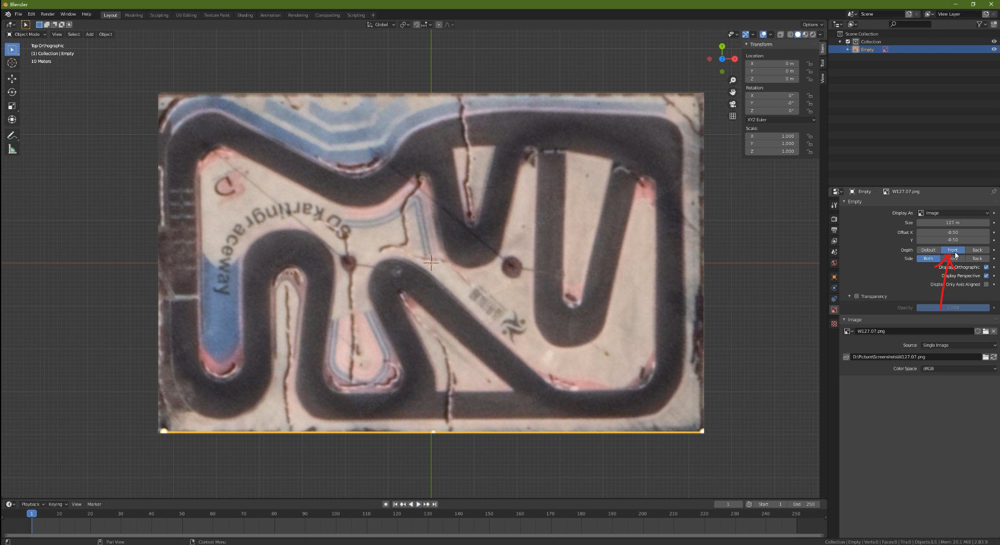

将游标设定在起点附近， 新建一个平面，进入编辑模式

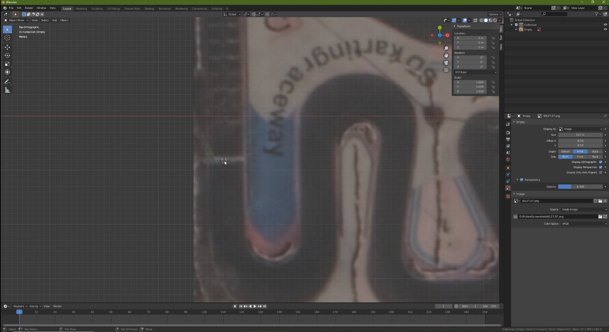

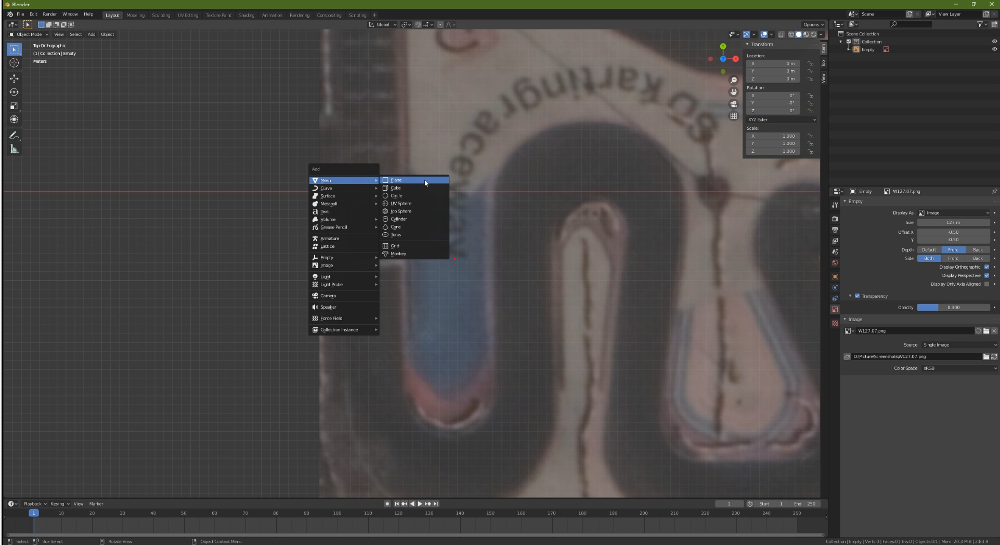

添加新的边，慢慢覆盖整条赛道

铺赛道的时候注意最好把路肩的部分也覆盖到

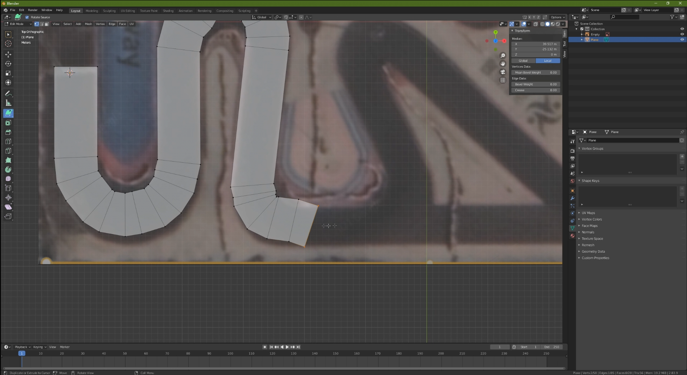

将pits的区域也用面覆盖到

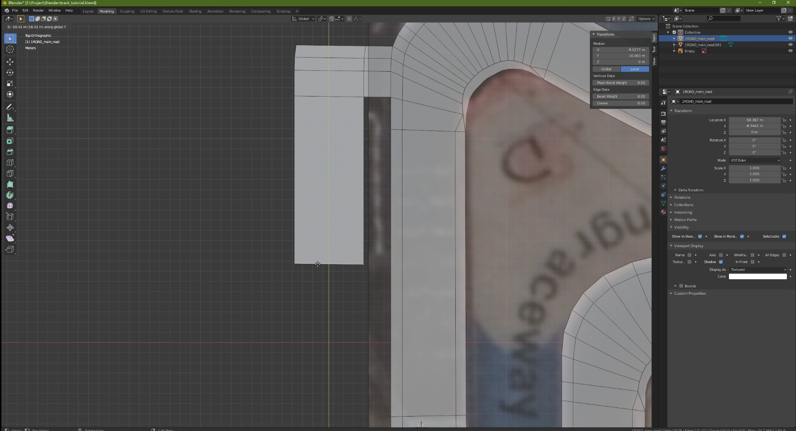

对赛道部分进行环切，细分到可以覆盖路肩的宽度就可以了

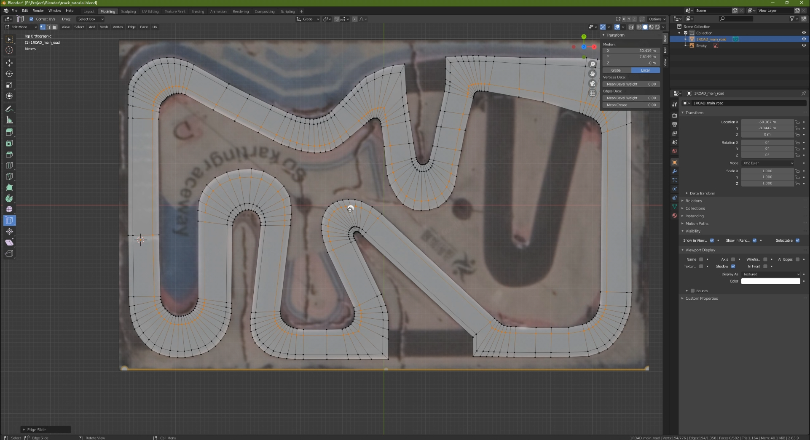

用小刀工具对路肩附件的面进行切割

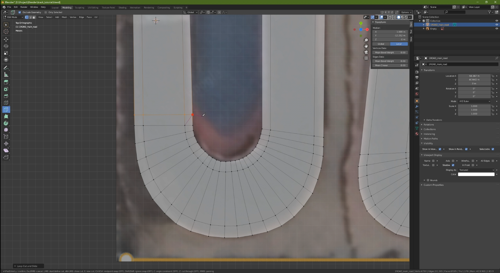

将赛道，路肩，维修区分离成单独的对象

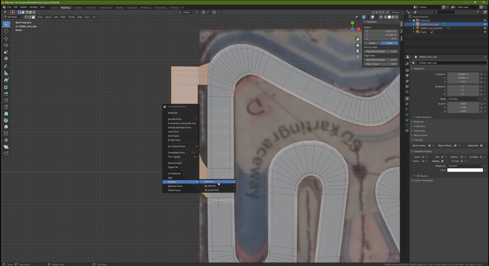

这样赛道的模型就完成了

新建一个平面，缩放至可以覆盖整个地图

回到顶视图

按住shift键先选中除了新建平面以外的区域

最后选中新建的平面

切换到编辑模式

选择 `mesh -> knife project` 在新的平面上刻下之前的赛道区域

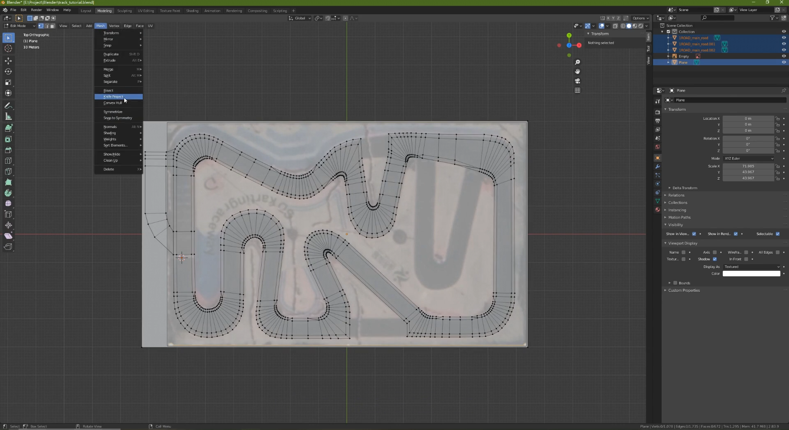

回到模型界面，单选新的平面

进入编辑模式删掉刚刚切出来的区域，留下赛道区域的轮廓

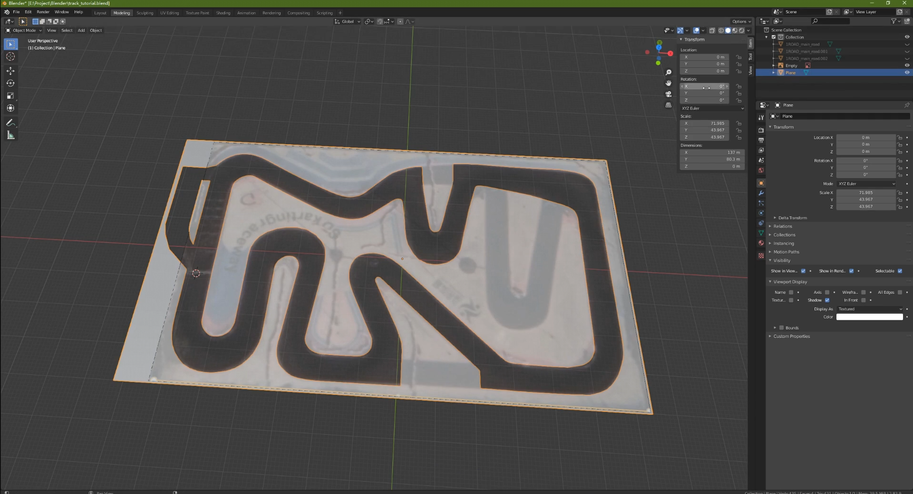

## 2.2 贴图和材质

选择路面，右侧材质选项中点击+号新建材质

在材质属性中的 `Base Color` 点后面的圆点，选择

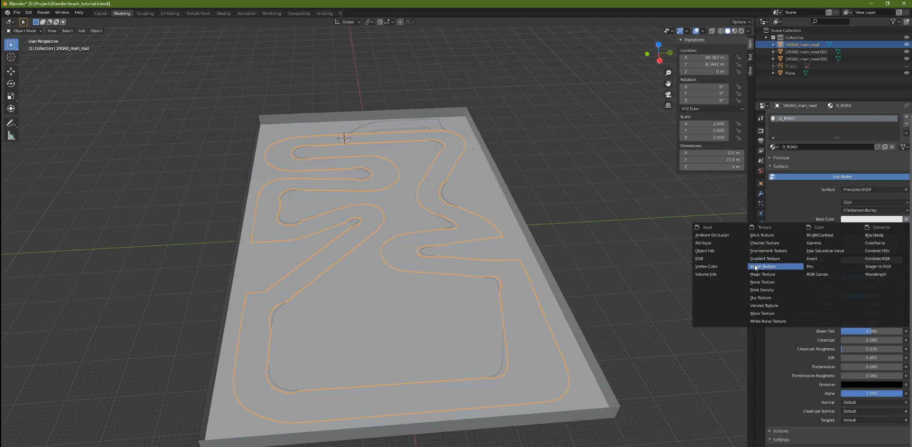

选择事先准备好的材质文件

将起点区域和材质的出发区对齐

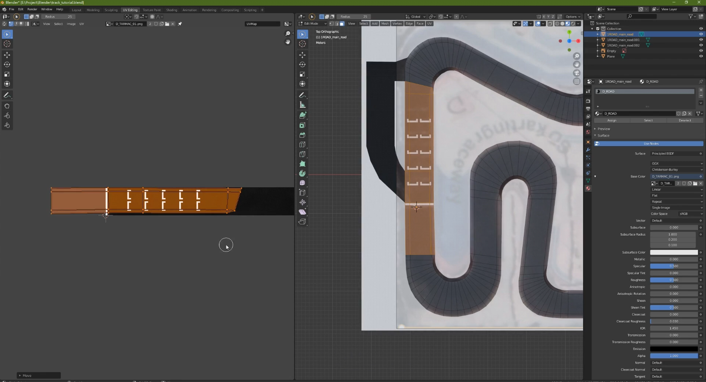

其余区域映射到黑色的柏油区域即可

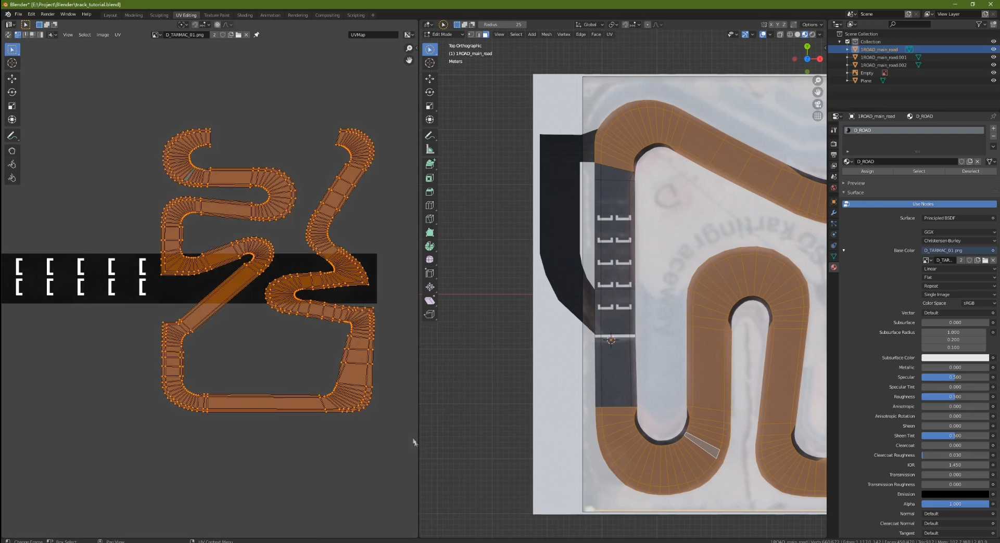

其余的实体的UV映射也都是类似的

下面我们再介绍一下blender中绘制贴图的方式

选择外沿的平面，先将平面映射到一个基本的纹理上

之后进入 `Texture Paint` 界面

在这里可以直接用画笔绘制或者将一些贴图直接画在原本的素材上

选择右边的画笔工具属性

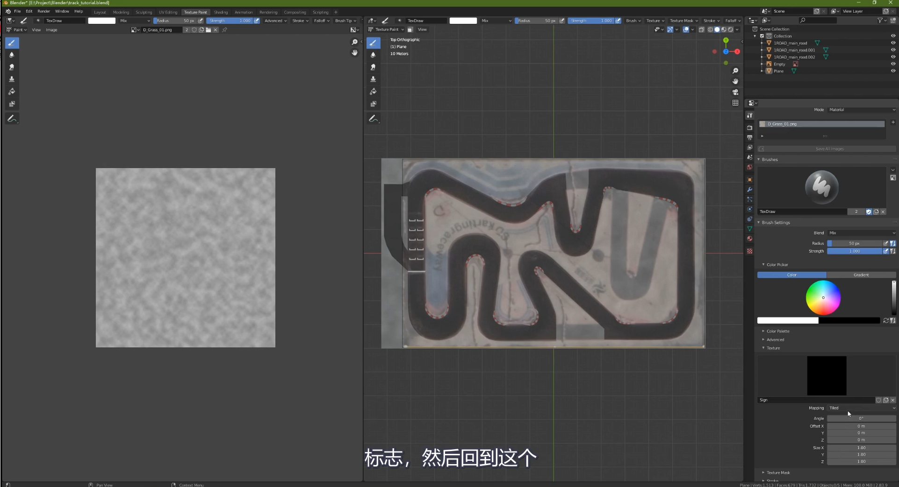

找到下面的Texture选单，新家一个图案

选择下面的图片属性选单

打开需要绘制的贴图

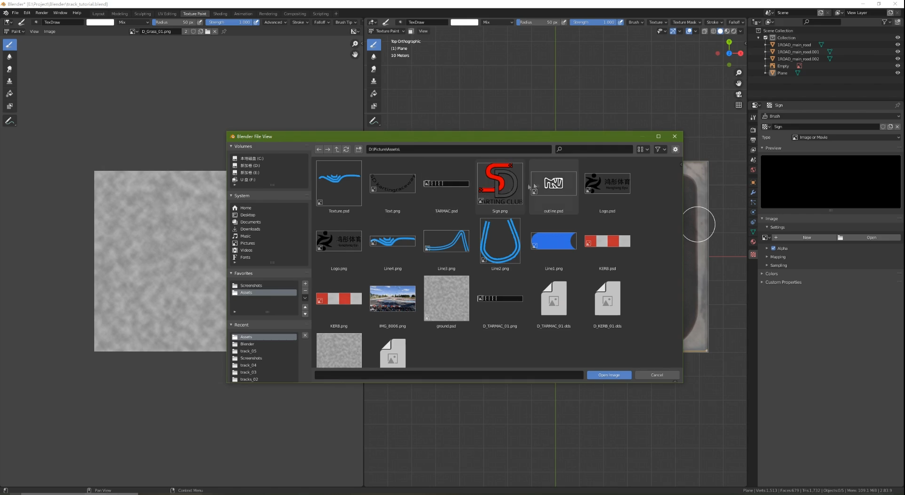

回到画笔工具的属性页面，Mapping属性选择 `Stencil`

现在在绘图区域就可以看到一个半透明的图案了

鼠标右键移动图案，按住shift + 右键 进行缩放， ctrl + shift 可以进行 旋转

将图案放置到喜欢的位置， 左键绘制

绘制完成后可以看到左侧原本的素材上对应位置就有了相应的图案

在左上角 `image` 选单里可以把新的图案进行保存

后面的工作就是不断的重复之前的步骤将各个实体都安排好贴图纹理

如果有兴趣也可以安插一些小细节

我在这里增加了一些地图中的墙体，还有一些装饰物

# 3. 导出模型

## 3.1 命名规则

### 3.1.1 实体

在到导出模型前，我们要对所有模型实体的名字进行一些规范

AC的引擎支持的模型命名规则是

    <ID><KEY><optional_suffix>

第一段 `ID` 是一个标志，所有大于0的取值都会将实体绑定到对饮的物理属性上，但是如果是0则不会

第二段 `KEY`， 注意这两段中间没有分割，是直接链接在一起的；
在第一部分我们说过，`data/sufaces.ini` 文件中的 `KEY` 字段回对应到模型的名字, 也就是对应到上面这个 `KEY`

除了我们在第一节中，在`data/sufaces.ini` 文件中定义的 `KEY`, 还有一个内建的材质

`WALL` -> 物理碰撞体， 使用这个KEY的实体会拥有与车体碰撞的效果，切物体是静态的，也就是车撞不动的墙

最后一段 `optional_suffix` 是可以自定义的区域，这里可以区分同材质的不同实体

除了静态的实体之外，游戏也提供可以互动的动态实体

    AC_POBJECT_suffix

以这个名字命名的实体与车碰撞之后会发生位移，可以将路锥一类的可以运动的实体设置成这个名字（开发者建议地图中可移动实体的数量不要超过15个，只是建议值）

### 3.1.2 非碰撞体

**赛道模式**：

    AC_START_<x> 

赛道发车点 x 最后的部分是从0开始计数的发车点, 例如 `AC_START_0, AC_START_1`

    AC_PIT_<x> 

维修区发车点, 计数规则同上， 例如 `AC_PIT_0, AC_PIT_1`

    AC_HOTLAP_START_<x> 
    
动态发车点, 计数规则同上， 例如 `AC_HOTLAP_START_0, AC_HOTLAP_START_1`

    AC_TIME_<x>_L
    AC_TIME_<x>_R

计时点，L R 分别代表从车辆行驶方向的左右， 计数规则同上，但是最多支持3个， 序号0 需要放在起点（终点）

**A到B模式**

    AC_AB_START_L, AC_AB_START_R
    AC_AB_FINISH_L, AC_AB_FINISH_R

规则类似上面

## 3.2 应用

对应到我们之前建立的模型中

像没有实际用途的装饰物，我们就以 `0` 开头

    0Light2
    0Light2.001
    0Light2.002
    0Tires1
    0Tires2
    ...
    0Tires2.005

这里面 `0Tiresxxx` 对应的是周围的轮胎墙

    PS. 为什么应该有碰撞的轮胎墙不是1开头而是0开头的呢？
    这里这样命名是为了演示如何处理地图中的复杂对象，有一些地图中的装饰或墙体很复杂，
    会对应很多曲面，如果直接将复杂的物体设置成有碰撞体积的实体，会加重游戏引擎在非必要事情上的运算
    所以这里使用更为简单的方块，直接覆盖轮胎墙的区域，来代替可见的轮胎实现碰撞

接下来是赛道外的草地（水泥地）

    1GRASS_main_grass

路肩

    1KERB_main_kerb

维修区道路

    1KERB_main_kerb

赛道

    1ROAD_main_road

赛道中的墙体

    1WALL_frame
    1WALL_out_wall
    1WALL_red_wall
    1WALL_sentrybox
    ...
    1WALL_tire_wall_1 (对应了轮胎墙的碰撞体)
    1WALL_white_wall

非碰撞体可以直接使用blender中的空对象来充当

新建一个空对象

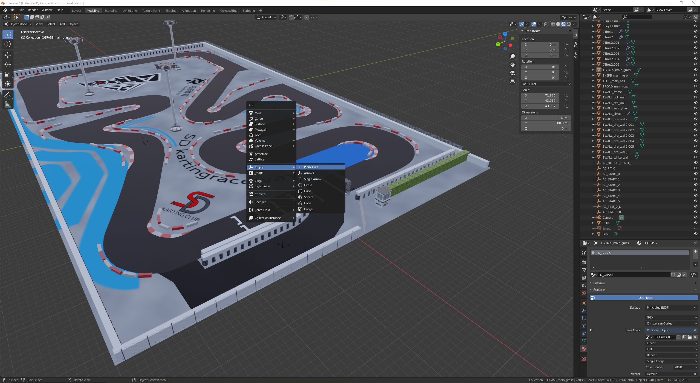

右侧对象属性，将显示模式改为箭头

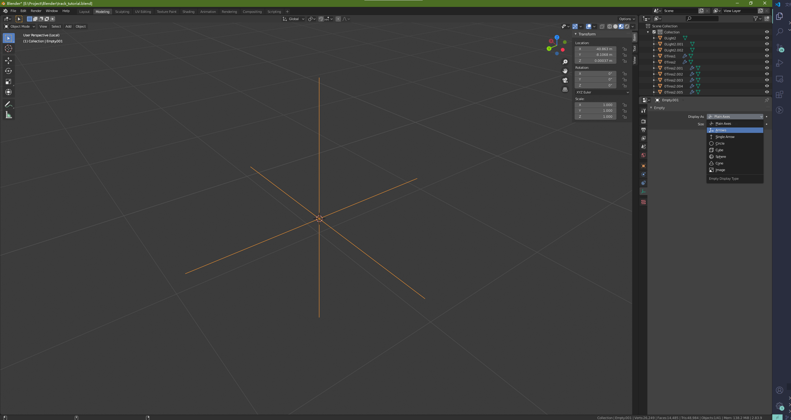

延x轴旋转空对象90度， 使y轴向上

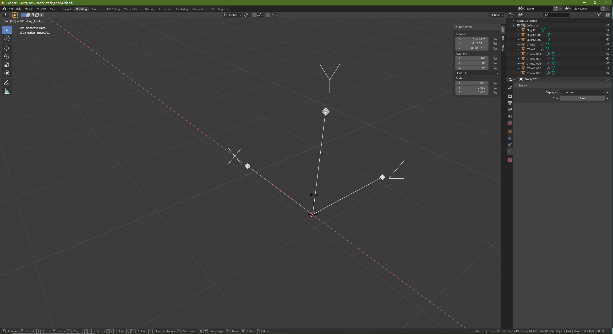

此时 z 轴方向对应前方

复制空对象，统一放置在距离赛道1m左右的地方，按照上面的规则摆放好，对应正确的名字。

## 3.3 导出

选中所有需要导出的实体

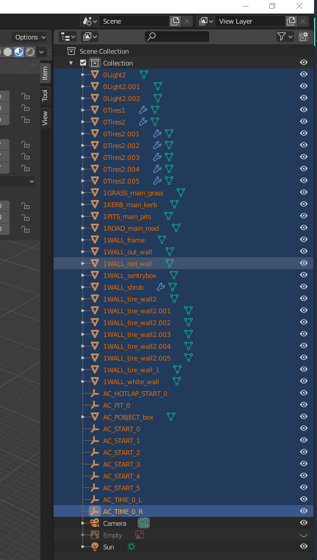

点击 `File -> Export -> FBX(.fbx)`

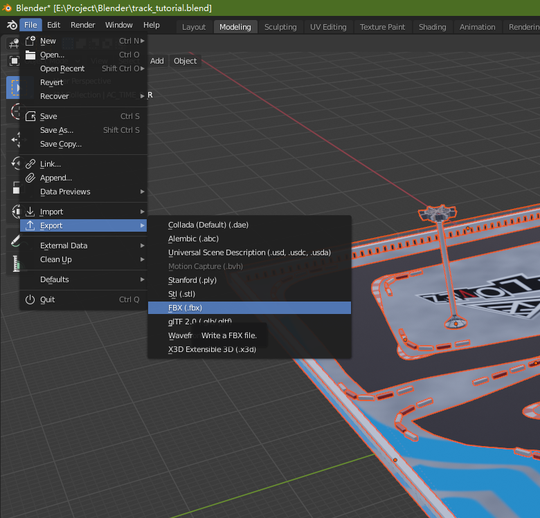

选择一个空目录进行导出

需要注意的配置有

    Path Mode: Copy 这样对应的贴图文件会被放在模型文件同级目录的一个文件夹里
    Selected Objects： 勾选 只导出选中的模型实体
    Object Types： 全选
    Scale： 1.00 确保单位统一
    Apply Scalings： 将缩放应用到FBX文件
    Up：Y Up: 将Y轴设定为朝向上的轴
    Apply Transform： 不要勾选

点击 `Export FBX`, 完成模型导出

# 4. 导入AC SDK

打开AC SDK

    File -> Open FBX

找到刚刚保存模型的目录， 将存储图片的文件夹改名为 `texture`

打开刚刚导出的 FBX

导入后先在下面找到 `Illumination` 选单

    将 `Weather` 改成 `3_clear`, `Load Weather`

    将 `PPfx` 改成 `defaut`, `Load PPfx`

将鼠标放在最大的方框中，此时鼠标左键移动视角，方向键移动，可以浏览一下地图， 右键点击选择实体选中

首先处理需要隐藏的实体

选择 `1WALL_tire_wall_1`， 在下面回到 `Object` 选单

    CastShadow -> False
    IsRenderbale -> False

其他同理

选择赛道区域

左上角 `Meterial`

这里面的几个数据决定了游戏中模型的视觉效果

    ksAmbient 环境光
    ksDiffuse 漫反射
    ksSpecular 镜面反射
    ksEmissive 发光
    ksAlphaRef 透明

这几个参数没有什么标准，自己可以调着看，觉得差不多顺眼了，就可以了

# 5. 导出游戏地图

设定完材质可以进行一次保存， `Flie -> Save Presistance`

保存下来的是一个配置文件，下一次模型如果有一些小的修改，重新导入后可以直接 `Load Presistance`

最后是导出游戏地图文件 `Flie -> Save KN5`, 将模型保存成与地图文件夹名相同的 `kn5` 文件。

# 6. 试玩

打开游戏，找到新建的地图，打开游戏的方法各位老司机就不需要我多说了吧

进入游戏后可以在不同的路段走一走看看判定是否完整，撞一撞墙体之类的检查一下有没有遗漏，如果觉得不满意可以回到Blender对模型进行修改，之后再导入SDK重新生成地图模型文件即可

